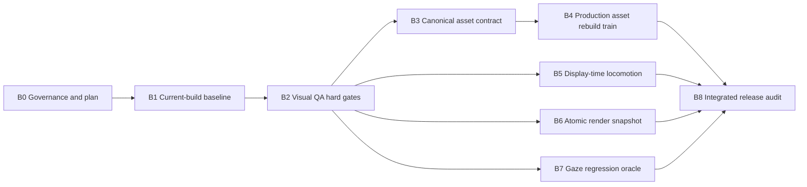

# Pet visual-remediation execution plan

- Plan-ID: PLAN-20260724-PET-VISUAL-REMEDIATION
- Status: active-planning
- Owner: repository maintainers
- Created: 2026-07-24
- Last-Updated: 2026-07-26
- Master-Register: https://github.com/lenxyliu/CatAtWork/issues/15
- Child-Issues: #9–#14 and #16–#21
- Current-Production-Evidence: `assetVersion 2026.07.23.6`
- Current-Checkpoint: B1 accepted by squash-merging
  [PR #23](https://github.com/lenxyliu/CatAtWork/pull/23) to
  `main@054c05f4450a162b981d980456abdc443521a530`; final reviewed head
  `273057ad7663a1c7df775821cc1a7c929e7a0324` passed hosted `governance` and
  `swift`; publication closure is CHG-20260726-001 and B2 has not started

## 1. Objective

Remove the confirmed pet animation, identity, motion, timing, and rendering
defects without converting visual judgment into undocumented one-off edits.
The program is complete only when:

1. every confirmed child Issue has an independent current-build badcase;
2. shared asset and runtime contracts are explicit and deterministic;
3. production assets and runtime behavior pass content-matched automatic gates;
4. required 60 Hz and 120 Hz native-device evidence passes;
5. the release candidate has zero errors and zero unwaived warnings; and
6. each Issue can be closed from durable evidence without relying on chat
   history.

This plan coordinates future implementation. It is not, by itself,
authorization to modify production code or assets.

## 2. Source-of-truth hierarchy

When records disagree, use this order:

1. **GitHub child Issue** — current defect facts, evidence boundary, hypothesis,
   acceptance criteria, and lifecycle.
2. **GitHub #15** — complete active-defect inventory and analysis queue.
3. **This plan** — dependency order, batch ownership, entry/exit gates, and
   cross-task handoff.
4. **Repository ISSUE/BC/ADR/CHG/design records** — immutable engineering
   rationale and reproduction contract for a change entering implementation.
5. **TR/audit records** — exact execution and release evidence for one content
   digest.
6. **Chat transcript** — temporary coordination only; never the sole record of
   a decision, failure, status, or acceptance result.

Raw private recordings remain local. Public or governed evidence must be
cropped/redacted and contain no private screen content or local absolute path.

## 3. Work-unit rules

- Keep child Issues separate even when one implementation fixes several. This
  preserves independent reproduction and acceptance.
- Group a PR by one shared root contract or subsystem, not by symptom count.
- Use one primary Codex task, one branch, one CHG, and one bounded batch at a
  time. A batch may link several Issues only when the same implementation
  boundary affects all of them.
- Do not repair production frames before the automatic gates and canonical
  identity/geometry contract are reviewable.
- Do not change code for a hypothesis-only Issue until a current-build badcase
  reproduces the risk or an explicit architecture decision accepts preventive
  hardening.
- Keep failed tests and failed visual evidence. A rerun creates a new TR.
- An Issue stays `fixed-unverified` until a passing content-matched TR exists.
  Real-device acceptance remains a separate gate.
- Merge sequentially into `main` with squash PRs. Start the next dependent
  branch from the merged predecessor, not from an unreviewed chat workspace.

## 4. Dependency map



`B5`, `B6`, and `B7` are logically independent after B2, but their final merge
and release evidence must be evaluated against the same accepted production
asset package from B4.

## 5. Batch plan

### B0 — Publish governance and this plan

- Branch: `codex/visual-defect-tracking-rule`
- Primary record: GitHub #15
- Product changes: none
- Current status: local-ready; governance and plan commits exist, remote branch
  and PR do not

Deliverables:

1. `AGENTS.md` visual-defect rules;
2. this execution plan;
3. CHG/TR records for both governance changes;
4. one draft PR targeting `main`.

Exit gate:

- local governance check passes;
- PR `governance` and `swift` checks pass on the final head;
- the final PR diff contains only the intended Markdown governance records;
- squash merge completes before B1 starts.

Rollback:

- revert the rule reference while preserving CHG/TR and GitHub issue history.

### B1 — Establish a content-matched current-build baseline

- Proposed branch: `codex/pet-visual-baseline`
- Issues: #9–#14 and #16–#21
- Product changes: none

Purpose:

Separate current confirmed defects from historical evidence and unverified
risks before implementation begins.

Required work:

1. Allocate stable local ISSUE identities for every GitHub defect entering
   implementation, with explicit GitHub links.
2. Create at least one independent current-build BC for each confirmed root
   scope. Historical-only and risk-only records must say so explicitly.
3. Build from clean accepted `main`; expose app commit/build, asset version,
   active action, frame, root position, velocity, source, and refresh rate in
   evidence.
4. Reproduce or reject each child Issue against the exact current commit and
   package digest.
5. Generate contact sheets, loop previews, endpoint matrices, component scans,
   color/geometry metrics, and runtime traces without editing production data.
6. Record all failures in new immutable TRs. A baseline failure is evidence,
   not a reason to loosen a threshold.

Exit gate:

- every child Issue is classified as `current-confirmed`,
  `historical-regression`, or `pending-risk`;
- every current-confirmed Issue has a repeatable BC and exact evidence digest;
- #13 has synchronized `animation/velocity/position/source/refresh` evidence;
- #17 has all 31 action endpoints reviewed against pose declarations;
- #19 has an explicit delay-injection reproduction decision;
- #20 has a current-build gaze/body comparison baseline.

### B2 — Build visual QA hard gates

- Proposed branch: `codex/visual-qa-gates`
- Primary Issue: #14
- Enables: #9–#13 and #16–#21

Purpose:

Make current failures measurable before repairing them.

Required governance:

- create a dedicated ISSUE/BC mapping and CHG;
- because this changes test/release policy, create a new ADR and append a
  revision to `docs/design/TEST-AND-RELEASE.md`;
- if a report schema or package metadata contract changes, update its design
  document and ADR scope explicitly.

Implementation scope:

1. Add a deterministic visual-report schema with content digest, tool versions,
   package version, action/frame identifiers, metric values, threshold source,
   and waiver identity.
2. Provide two modes:
   - `baseline`: known current failures are enumerated and no new failure may
     appear;
   - `release`: zero errors and zero unwaived warnings.
3. Add fixture tests that intentionally fail every metric family.
4. Add spike and second-difference detection; averages cannot hide an isolated
   frame.
5. Add action-specific contracts for semantic squash/stretch, airborne
   movement, support phases, and allowed disconnected components.
6. Require every waiver to name an Issue, rationale, owner, affected
   action/frames, and expiry date.

Metric families:

- source/atlas round-trip scale and alpha;
- canonical identity landmarks and topology;
- root/support anchors and contact feet;
- per-material CIEDE2000 color;
- connected components and edge clearance;
- adjacent, batch-seam, and true loop-seam continuity;
- actual endpoint pose versus manifest declaration;
- state, animation, velocity, displacement, stride, and contact phase;
- frame presentation cadence at 60 Hz and 120 Hz;
- render snapshot integrity under injected texture delay;
- gaze/body pixel orthogonality.

Exit gate:

- all negative fixtures fail for the intended reason;
- the current defective package cannot return release-pass;
- baseline mode lists every approved known failure explicitly;
- release mode has no implicit warning-only escape path;
- outputs are deterministic for identical input content.

### B3 — Define and implement the canonical asset contract

- Proposed branch: `codex/canonical-pet-asset-contract`
- Root Issues: #9, #11, #12, #16, #17, #21
- Production raster changes: none in the contract PR

Purpose:

Remove pipeline behavior that bakes inconsistent scale and unstable pivots into
otherwise repairable artwork.

Required governance:

- create a new ADR because asset/package semantics change;
- append revisions to `docs/design/ASSET-PIPELINE.md` and
  `docs/design/CATPET-CONTRACT.md`;
- record compatibility and migration behavior for existing `.catpet` packages.

Contract decisions to review:

1. One canonical `pixelsPerBodyUnit`; packaging must not resize individual
   frames or actions.
2. One fixed authored canvas and safe margin policy per compatible package.
3. Explicit body root and support/contact anchors; alpha bbox center/bottom is
   not an anatomical root.
4. Canonical identity rig: eye centers, ear roots, nose/mouth, head/mask
   outline, shoulder/hip, limb joints, tail root, and comparable material ROIs.
5. Actual start/end pose signatures linked to `startPose/endPose`.
6. Declared sRGB input and deterministic color conversion.
7. Explicit whitelist for semantic disconnected components; default is none.
8. Deterministic source-to-atlas round-trip with pixel/alpha digest evidence.
9. Compatibility handling for legacy `authoringScale`, `bodyScale`, and
   missing anchor/pose metadata.

Exit gate:

- synthetic fixtures prove that tail/fur extent cannot move the body root;
- changing silhouette bounds cannot change world scale;
- source pixels survive packaging without implicit resize;
- invalid anchors, poses, color metadata, or components fail closed;
- the current production package is not silently rewritten in this PR.

### B4 — Rebuild production assets against the frozen contract

- Program branch prefix: `codex/default-pet-visual-`
- Issues resolved by the train: #9, #10, #11, #12, #16, #17, #21

Purpose:

Repair the artwork once against a frozen identity, scale, anchor, color, and
pose system instead of repeatedly applying unrelated per-frame corrections.

Freeze before editing:

1. canonical identity sheet and per-view landmarks;
2. canonical scale, root, support line, and pose templates;
3. material color references and ROI masks;
4. action-family semantics and allowed deformation budgets;
5. B2 release thresholds and B3 package contract.

Recommended PR slices:

1. `foundation`: idle, seated/standing/lying references, authored pose bridges,
   and left/right locomotion;
2. `interaction`: petting, grooming, wave, curiosity, idle micro-actions, and
   related transitions;
3. `physical`: jump, pickup, thrown, landing, belly/lying actions, and other
   high-deformation sequences;
4. `integration`: deterministic full package rebuild and cross-family
   transition matrix, with no manual edits to generated atlas output.

Rules for the train:

- each action family is generated/repaired once from the same frozen reference;
- a later slice must not silently retouch an accepted earlier family;
- production rasters require Git LFS verification before staging;
- drafts and QA previews stay outside production paths;
- every slice produces root-aligned and head-aligned contact sheets, loops,
  metrics, and a TR;
- child Issues remain separate and are closed only when their own affected
  action matrix passes, even if one PR changes many frames.

Exit gate:

- all 31 actions and 744 frames pass B2 release mode;
- all legal pose edges pass endpoint and bridge checks;
- no action-level or per-frame resize remains;
- no unapproved disconnected component remains;
- identity, color, root, support, and topology gates pass;
- native fixed-background review shows no frame spike, size pulse, color flash,
  or baseline jump for at least five loops per looped action.

### B5 — Unify display-time animation and locomotion

- Proposed branch: `codex/display-time-locomotion`
- Issues: #13 and #18

Purpose:

Treat animation phase, physical displacement, stride/contact phase, and
display sampling as one coherent motion contract.

Required governance:

- create current-build BCs for every locomotion entry path;
- create an ADR if clock or root-motion ownership changes;
- append revisions to `RUNTIME-STATE-MACHINE.md`,
  `SYSTEM-ARCHITECTURE.md`, and `TEST-AND-RELEASE.md` as applicable.

Implementation boundaries:

1. Behavior decisions may remain low frequency, but animation sampling and
   spatial integration use the display timestamp and preserve fractional time.
2. Define `nominalSpeed`, `strideLength`, direction, contact phases, and
   start/stop budgets for walk/run.
3. Route preview, pointer, shoo, autonomous roam, and deceleration through one
   locomotion invariant.
4. Make an explicit product decision:
   - behavior preview establishes valid root motion; or
   - sprite-only preview is labeled and excluded from behavior acceptance.
5. Keep core timing deterministic with simulated timestamps; use device tests
   only for presentation cadence and visual confirmation.

Exit gate:

- no steady locomotion animation with near-zero speed beyond the declared
  start/stop budget;
- one-second displacement is 90%–110% of nominal;
- per-cycle displacement is within 5% of stride length;
- support-foot slip is at most 2 authored pixels;
- 60 Hz/120 Hz distance differs by at most 1%;
- 60-second animation phase drift is less than one source frame.

### B6 — Verify and, if required, implement atomic render snapshots

- Proposed branch: `codex/atomic-render-snapshot`
- Issue: #19
- Status: conditional on B1 reproduction or an accepted preventive-hardening
  decision

Red-first work:

1. inject texture delays of 0, 16, 50, 100, and 250 ms;
2. traverse every cross-atlas edge plus rapid cancellation and package
   generation replacement;
3. record visible alpha, texture ID, atlas rect, position rect, generation, and
   presentation timestamp.

Implementation boundary if reproduced:

- publish `texture + atlasRect + positionRect + generation` atomically;
- retain the last complete snapshot until the next one is complete;
- cancel pending work without clearing the published snapshot;
- reject stale generation results.

Exit gate:

- no transparent pet frame;
- no old texture with new UV/position;
- only the prior complete frame or the next complete frame is displayed;
- delay, cancellation, rapid switching, and generation replacement tests pass.

If the current build does not reproduce the visible defect, preserve the test
and evidence, update #19 accurately, and do not invent a user-facing fix.

### B7 — Lock gaze/body orthogonality

- Proposed branch: `codex/gaze-body-regression`
- Issue: #20
- Expected product change: test-only unless the current build fails

Required work:

1. fix one body action/frame/root and enumerate all 16 look directions;
2. compare non-eye RGB/alpha pixel-for-pixel;
3. assert unchanged body action, frame, root, pivot, atlas, collision data, and
   texture request count;
4. stress rapid gaze changes.

Exit gate:

- only the approved eye ROI changes;
- no texture reload, body transition, root change, or outline change occurs;
- the historical recording remains linked as a regression badcase;
- current status is based on current-build evidence, not the old recording.

### B8 — Integrated candidate and closure audit

- Proposed branch: `codex/pet-visual-release-audit`
- Scope: #9–#14 and #16–#21
- Product changes: none; fixes discovered here return to the owning batch

Required matrix:

- all 31 actions and true loop seams;
- all legal pose transitions and authored bridges;
- all locomotion entry/exit paths;
- cross-atlas transitions under injected delay;
- gaze directions during idle and locomotion;
- 60 Hz and 120 Hz displays;
- fixed-background native recordings;
- three-minute autonomous run plus targeted high-salience actions.

Exit gate:

- zero error and zero unwaived warning in release mode;
- every passing TR matches the candidate content digest;
- no skipped mandatory automatic or device case;
- each GitHub child Issue contains its independent closing evidence;
- #15 is updated only after all child statuses are evidence-backed;
- a new candidate audit records exact commit, package digest, system, display,
  and evidence paths.

## 6. Issue-to-batch ownership

| Issue | Primary batch | Secondary verification |
| --- | --- | --- |
| #9 frame geometry/size jitter | B4 | B2, B3, B8 |
| #10 color jumps | B4 | B2, B8 |
| #11 cross-action scale/proportion | B3/B4 | B2, B8 |
| #12 root/support jitter | B3/B4 | B2, B5, B8 |
| #13 walking in place | B5 | B1, B2, B8 |
| #14 validator false pass | B2 | every later batch |
| #16 detached components | B4 | B2, B3, B8 |
| #17 pose declaration mismatch | B3/B4 | B1, B2, B8 |
| #18 30 Hz cadence quantization | B5 | B2, B8 |
| #19 async transparent-frame risk | B6 | B1, B2, B8 |
| #20 historical gaze/body coupling | B7 | B1, B2, B8 |
| #21 identity drift | B4 | B2, B3, B8 |

## 7. Cross-task handoff protocol

### Before ending a batch task

The active task must:

1. stop at a reviewable boundary, not halfway through an unexplained
   destructive asset rewrite;
2. append evidence/status to the affected GitHub Issues and #15;
3. update the progress ledger below;
4. finalize or accurately leave draft the batch CHG;
5. create a new TR for every executed test run, including failures;
6. record exact branch, commit, base commit, dirty paths, commands, failures,
   evidence paths, and the single next action;
7. commit intended durable files so a new task does not depend on an untracked
   local note;
8. leave the worktree clean, or explicitly list every intentional uncommitted
   path and why it remains; and
9. fill `docs/templates/CODEX-BATCH-HANDOFF-TEMPLATE.md`, select exactly one
   next-task route, and place the resolved handoff plus copyable Prompt in the
   final response.

### At the start of a new batch task

The new task must not rely on the previous chat summary. It must:

1. select the repository and the exact intended branch or merged base;
2. read `AGENTS.md`, this plan, `CONTRIBUTING.md`, #15, every child Issue in
   scope, every linked local ISSUE/BC, and affected design/ADR/CHG records;
3. run `git status --short --branch`, inspect recent commits, and verify the
   expected base SHA;
4. rerun the current badcase or failing oracle before changing code/assets;
5. confirm one batch, explicit non-goals, and the exit gate;
6. create a new CHG before a non-trivial modification.

### Copyable new-task prompt

```text
Continue PLAN-20260724-PET-VISUAL-REMEDIATION, batch <B# only>.

Repository: /Users/oops/Documents/养猫爱猫计划
Expected base/branch: <branch and commit>
Primary GitHub issues: <numbers>

Before changing anything, read AGENTS.md, CONTRIBUTING.md,
docs/plans/PLAN-20260724-PET-VISUAL-REMEDIATION.md, GitHub #15, every scoped
child Issue/comment, and all linked local ISSUE/BC/design/ADR/CHG records.

First verify git status and reproduce the current badcase. Implement only this
batch. Preserve failed evidence, create the required CHG/ADR/TR records, run
the batch exit gates, update the GitHub issues and plan handoff ledger, then
commit the bounded result. Do not begin the next batch.
```

### Mandatory next-task route decision

At every batch completion, pause, or blocker, choose exactly one:

| Route | Use when | Do not use when |
| --- | --- | --- |
| `CONTINUE_CURRENT` | The same bounded batch is still in progress, recent reasoning is needed, the transcript remains focused, and no PR/subsystem boundary was crossed. | The next action belongs to another batch or the transcript is dominated by old logs and unrelated exploration. |
| `NEW_LOCAL_TASK` | Default at a batch/PR boundary; the next work is sequential; native app/device state, one running pet instance, or the main local checkout is needed. | Independent work must proceed without disturbing an active local branch. |
| `NEW_WORKTREE` | The next batch is independent, starts from an exact committed base, uses a distinct branch, and can be built/tested in isolation. | The same branch is checked out elsewhere, the base is uncommitted, or native validation depends on the one Local app instance. |
| `STOP_BLOCKED` | A required merge, CI result, external permission, hardware, evidence, or clean checkpoint is missing. | Meaningful safe work can still continue inside the current authorized batch. |

The route decision is mandatory even when no implementation changed. A new
task solves context isolation; a Worktree solves filesystem/branch isolation.
Do not recommend a Worktree merely to reduce token use.

The generated Prompt must resolve all of these fields:

- completed batch and evidence status;
- exact repository, branch, base commit, and latest durable commit;
- next batch, primary Issues, scope, and explicit non-goals;
- required first reads and first verification commands;
- whether a new branch must be created before edits;
- required tests/evidence and the batch exit gate;
- required GitHub/plan/CHG/ADR/TR updates;
- instruction to generate the following task's route and Prompt at the end.

If an exact commit or required merge result is unknown, select `STOP_BLOCKED`
instead of emitting a misleading Prompt with placeholders.

## 8. Codex task and context policy

- Use the current task for planning, decisions, and one bounded implementation
  batch. Do not run the entire B0–B8 program in one transcript.
- Start a fresh primary task at a PR/batch boundary. Repository files, commits,
  Issues, CHG/ADR/TR records, and this ledger carry state across tasks.
- Within one batch, continue the same task while iterative decisions depend on
  its recent reasoning. If command logs, images, or repeated failures dominate
  the transcript, summarize them into durable evidence and begin a new task
  from the latest committed checkpoint.
- Keep bulky logs and generated visual reports in files; put conclusions,
  digests, and evidence paths in the task transcript.
- Use separate worktrees only for truly independent batches. Never check out or
  mutate the same branch in two worktrees.
- When moving the same Codex task between Local and Worktree, use the app's
  Handoff flow. When starting a new task, use the copyable prompt above and an
  exact commit rather than assuming transcript inheritance.
- B0 through B4 and B8 default to sequential `NEW_LOCAL_TASK` handoffs. B5,
  B6, and B7 may use separate Worktrees only after their accepted base exists
  and only when the user actually wants parallel work.
- Native screen recording, refresh-rate acceptance, and other checks that
  require the single user-facing app instance should run in Local. A task may
  use Handoff from Worktree to Local for that final validation.

## 9. Progress and handoff ledger

Update rows and append dated events; do not erase a failed or superseded event.

| Batch | Status | Branch/checkpoint | Evidence/records | Single next action |
| --- | --- | --- | --- | --- |
| B0 | complete | `main@0ca2b518d5a079ace1ef1e6d9a6892a5259b080e` | CHG-20260724-001/002; TR-GOVERNANCE-20260724-001..004 | Preserve the accepted checkpoint |
| B1 | complete | [PR #23](https://github.com/lenxyliu/CatAtWork/pull/23); accepted `main@054c05f4450a162b981d980456abdc443521a530` | ISSUE-015..026; BC-018..029; CHG-20260724-003; CHG-20260726-001; TR-VISUAL-20260724-001..011; TR-GITHUB-20260724-003; TR-GITHUB-20260726-001..003; TR-GOVERNANCE-20260724-005; TR-GOVERNANCE-20260726-001..002; evidence manifest `1c037439b73fa07fa188b20efd8f08f5fcc24b547ba9d2a1e6124fd645bee0d6`; final head `273057ad7663a1c7df775821cc1a7c929e7a0324` passed hosted `governance`/`swift` | Preserve the accepted checkpoint |
| B2 | ready-not-started | start only from accepted `main` after B1 publication closure | GitHub #14; B1 current-confirmed baseline | Open a fresh Local task and create `codex/visual-qa-gates` before edits |
| B3 | blocked-by-B2 | not started | GitHub #9/#11/#12/#16/#17/#21 | Decide canonical scale/root/pose compatibility contract |
| B4 | blocked-by-B3 | not started | GitHub #9/#10/#11/#12/#16/#17/#21 | Freeze identity references before changing production frames |
| B5 | blocked-by-B2 | not started | GitHub #13/#18 | Reproduce all locomotion entry paths with synchronized logs |
| B6 | blocked-by-B2 | not started | GitHub #19 | Run delay-injection red test before deciding on a fix |
| B7 | blocked-by-B2 | not started | GitHub #20 | Add current-build gaze/body orthogonality oracle |
| B8 | blocked-by-B4/B5/B6/B7 | not started | all child Issues | Build one content-matched candidate matrix |

### Ledger events

- 2026-07-24: created after reviewing GitHub #9–#21, their comments, the
  relevant repository design documents, and legacy visual badcases.
- 2026-07-24: plan validated and committed as `8fa4db7`; B0 is ready for push
  and a governance PR.
- 2026-07-24: made end-of-batch route selection and next-Prompt generation a
  mandatory handoff artifact; defaulted sequential batches to new Local tasks
  and restricted Worktrees to independent work.
- 2026-07-24: B0 was merged to `main` as
  `0ca2b518d5a079ace1ef1e6d9a6892a5259b080e`; B1 started from that exact clean
  base on `codex/pet-visual-baseline`.
- 2026-07-24: B1 classified GitHub #9–#14, #16–#19 and #21 as
  `current-confirmed`, and #20 as `historical-regression`; no scoped Issue
  remains `pending-risk`. Stable identities ISSUE-015..026 and BC-018..029
  were allocated.
- 2026-07-24: B1 bound the clean app and asset 2026.07.23.6 to package digest
  `fed6c517ce352b00cb97479a922d897c77417a6f4f5c1110c0e874463b2118b8`,
  reviewed all 31 action endpoints, sampled every required locomotion entry at
  60/120 Hz, reproduced #19 under delay injection, and established a passing
  current-build gaze/body baseline for #20.
- 2026-07-24: child Issues and master register #15 received B1 evidence
  comments recorded by TR-GITHUB-20260724-003. B1 ends at the PR boundary;
  B2 remains blocked until this branch is accepted and merged.
- 2026-07-24: opened B1 publication
  [PR #23](https://github.com/lenxyliu/CatAtWork/pull/23) from exact head
  `81aa809cecea307ce8d52977e679e8d6558322a6`; the GitHub diff matched all 28
  intended Markdown paths. Initial hosted
  [`governance`](https://github.com/lenxyliu/CatAtWork/actions/runs/30082296506/job/89446428131)
  (19s) and
  [`swift`](https://github.com/lenxyliu/CatAtWork/actions/runs/30082296506/job/89446428052)
  (2m17s) passed. This ledger-only update must receive the same final-head
  checks before squash merge; B2 has not started.
- 2026-07-26: final B1 PR head
  `273057ad7663a1c7df775821cc1a7c929e7a0324` retained the exact 28 intended
  Markdown paths. Hosted
  [`governance`](https://github.com/lenxyliu/CatAtWork/actions/runs/30082612114/job/89447432442)
  passed in 21s and
  [`swift`](https://github.com/lenxyliu/CatAtWork/actions/runs/30082612114/job/89447432397)
  passed in 2m35s. PR #23 was reviewed and squash-merged as
  `054c05f4450a162b981d980456abdc443521a530`; GitHub #15 received
  [pre-merge evidence](https://github.com/lenxyliu/CatAtWork/issues/15#issuecomment-5083004891)
  and
  [accepted-merge evidence](https://github.com/lenxyliu/CatAtWork/issues/15#issuecomment-5083050161).
  Local `main` and `origin/main` matched the accepted merge with a clean
  worktree. No child Issue was closed or marked fixed, and B2 was not started.

## 10. Plan revision rules

- This is an evolving plan, not an accepted ADR. Update it through reviewed
  commits when evidence changes dependencies or exit criteria.
- Do not rewrite GitHub Issue history to match the plan. Append corrections to
  the Issue and then revise the plan.
- A future strategic implementation decision still requires its own ADR; this
  document cannot pre-approve architecture, package, or release-policy changes.
- Every plan revision appends a dated ledger event and links its CHG.

## Revision log

| Date | CHG | Revision |
| --- | --- | --- |
| 2026-07-24 | CHG-20260724-002 | Created the dependency-ordered repair program and cross-task handoff protocol. |
| 2026-07-24 | CHG-20260724-002 | Required an explicit next-task route and fully resolved Prompt at every batch boundary. |
| 2026-07-24 | CHG-20260724-003 | Completed the content-matched B1 classification, evidence identities, issue updates and B2 merge dependency. |
| 2026-07-24 | CHG-20260724-003 | Recorded B1 PR #23 and initial hosted check verification while keeping B2 blocked pending merge. |
| 2026-07-26 | CHG-20260726-001 | Recorded the reviewed B1 squash merge, final hosted checks, #15 publication evidence and B2 not-started boundary. |
